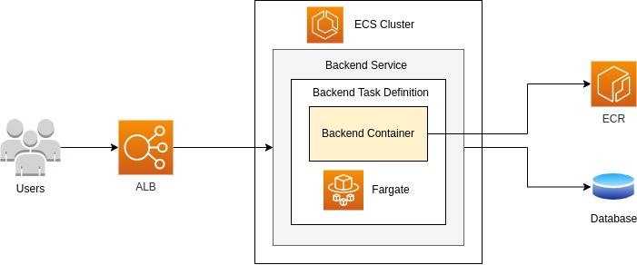
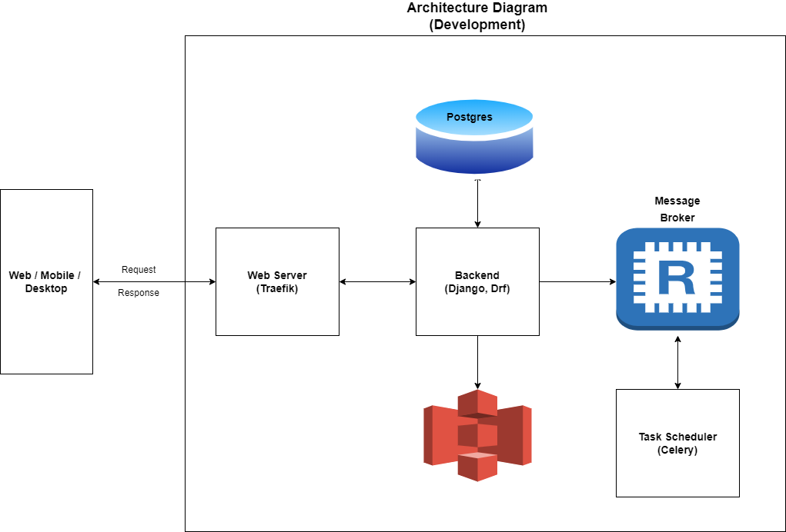
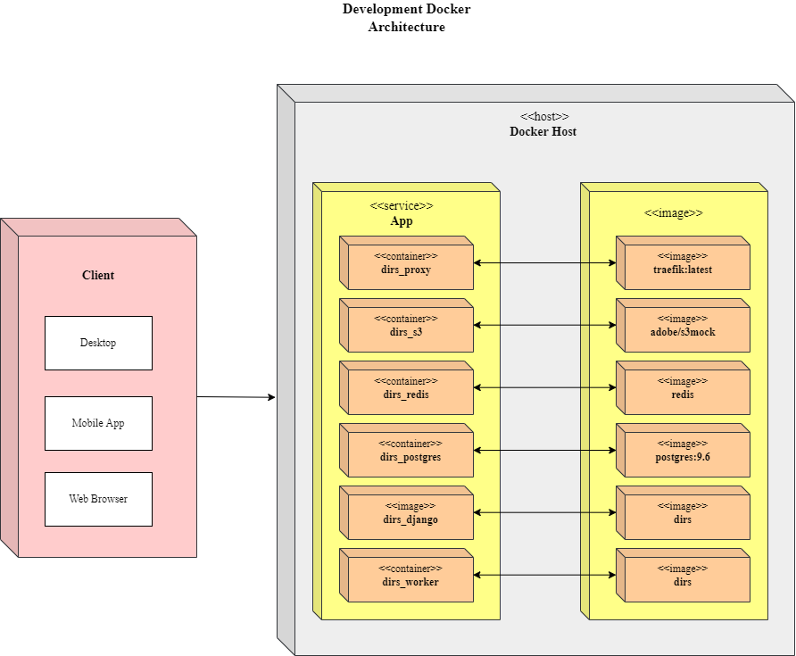
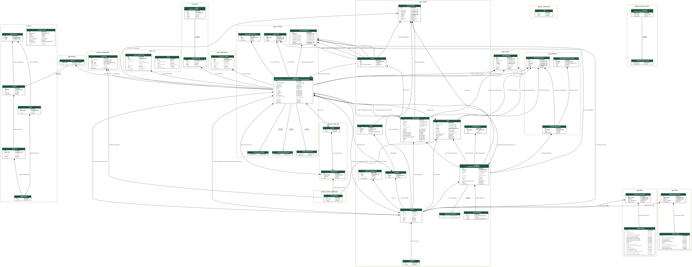
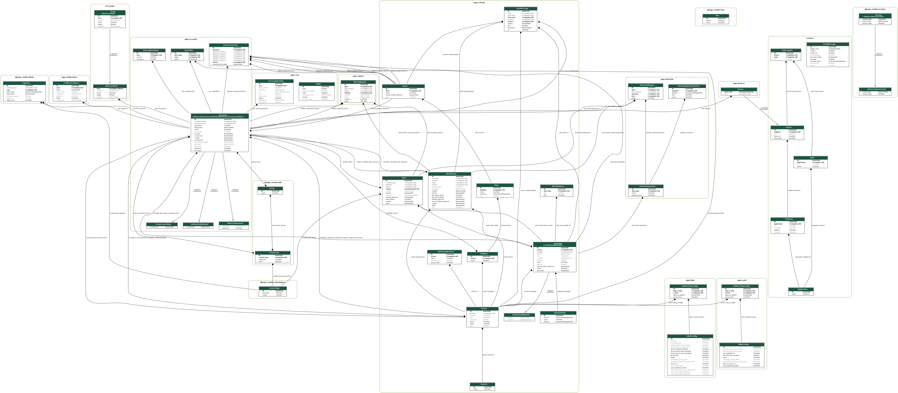
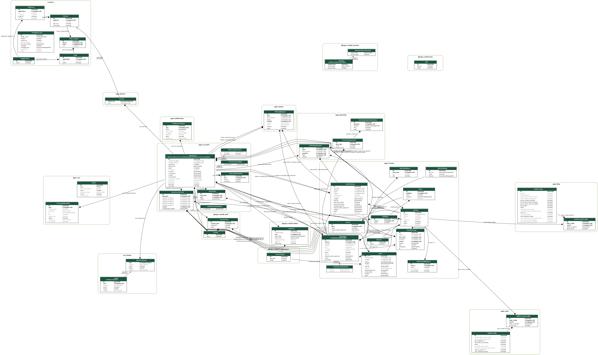

# Handoff Document for Dirs/Aegix Project

## Project Overview

### Project Name

* Dirs (Old System)
* Aegix (Rebrand)

### Project Description

The DIR-S ('Duress') / Aegix application is a real-time alert system available for computers and mobile devices. It provides a fully customizable platform to safely coordinate resources and personnel in emergency situations with unique alerts, live messaging, user-specific check-ins, and interactive mapping features.

## Team Information

### Current Team Members

* Sujan Raj Tuladhar (Backend)
* Tapan B.K (Backend)
* Sushan Shrestha (Backend)
* Nirajan Maharjan (Front-end Web)
* Suraj Bhandari (IOS)
* Aaush Shrestha (Android)
* Biraj Raut (QA)

### Receiving Team Members

* N/A

## Project Details

### Technology Stack

* **Backend Framework:** Django \[3.0.11\]
* **Database:** PostgreSQL
* **Frontend Web:** DIRS / Aegix \[Butterfly Library / React\]
* **Aegix (IOS):** Swift
* **Aegix (Android):** Kotline

### Project Repository

* [DIRS](https://github.com/DIR-S-Alert/dir-s) \[[https://github.com/DIR-S-Alert/dir-s](https://github.com/DIR-S-Alert/dir-s)\]
* [AEGIX](https://github.com/aegix-global/tiaki) \[[https://github.com/aegix-global/tiaki](https://github.com/aegix-global/tiaki)\]

### Deployment Details

* **Server Hosting:** AWS \[EC2 Instance\]
* **Domain:** [dirs.app](http://dirs.app), [dirsalert.com](http://dirsalert.com)

### Key Dependencies

* Clever Login
* LDAP (Lightweight Directory Access Protocol)
* SAML
* RapidSOS
* MapsPeople
* MirrorFly

## Environment Setup

### Local Development Setup

1. **Prerequisites:**
    * Docker \[[https://www.docker.com/](https://www.docker.com/)\]
    * Django:3.0.11 \[[https://www.djangoproject.com/](https://www.djangoproject.com/)\]
    * Gunicorn \[[https://gunicorn.org/](https://gunicorn.org/)\]
    * Nginx \[[https://www.nginx.com/](https://www.nginx.com/)\]
    * Python:3.6 \[[https://www.python.org/downloads/release/python-368/](https://www.python.org/downloads/release/python-368/)\]
    * Postgres:9.6 \[[https://www.postgresql.org/](https://www.postgresql.org/)\]
    * Redis \[[https://redis.io/](https://redis.io/)\]
    * SSO \[[https://www.onelogin.com/product/sso](https://www.onelogin.com/product/sso)\]
    * S3Mock \[[https://github.com/adobe/S3Mock](https://github.com/adobe/S3Mock)\]
    * Traefik:latest \[[https://traefik.io/](https://traefik.io/)\]

### Application Setup using Docker

1. **Dependencies**

Before setting up the application, ensure the following dependencies are installed:

* [Docker](https://docs.docker.com/engine/installation/)
* [Docker Compose](https://docs.docker.com/compose/install/)
* [Google Cloud Console](https://console.cloud.google.com/apis/credentials) account with "Service Accounts" credentials for API access.

2. **Install Docker and Docker Compose**
    * Install Docker: [Docker Installation Guide](https://docs.docker.com/desktop/install/)
    * Install Docker Compose: [Docker Compose Installation Guide](https://docs.docker.com/compose/install/)
3. **Clone Repository**

Clone the application repository from [GitHub](https://github.com/DIR-S-Alert/dir-s):

```plain
git clone https://github.com/DIR-S-Alert/dir-s.git
cd dir-s
```

4. **Create SAML Credentials**

For Linux/Mac Users:

Grant execution permission to the script:

```css
chmod a+x cert-setup.sh
```

Execute the script:

```plain
./cert-setup.sh
```

For Windows Users:

Place your SAML credentials in the root level of the repository with the following filenames:

* `sp_x509_public.cer`
* `sp_x509_private.cer`
* `sp_x509_csr.cer`

If you do not have these credentials, you can generate self-signed certs using [SAMLTool](https://www.samltool.com/self_signed_certs.php). After generating the certs, place them in the root of the repository.

5. **Create Google Service Credentials**

Create Google service credentials in the [Google Cloud Console](https://console.cloud.google.com/apis/credentials). Download the JSON credential file and place it in the root of the repository with the filename `google_creds.json`.

6. **Create** **`.env`** **File**

Create a `.env` file in the root level of the repository and fill in the necessary data based on your configuration. Choose one of the options below:

If Config Folder is Available and De\_cookie\_cutter\_2 Branch is Not Merged:

```bash
GOOGLE_APPLICATION_CREDENTIALS=google_creds.json

# Email
DJANGO_EMAIL_BACKEND=django.core.mail.backends.smtp.EmailBackend
EMAIL_HOST = 
EMAIL_HOST_USER = 
EMAIL_HOST_PASSWORD = 
EMAIL_PORT = 
```

If Branch De\_cookie\_cutter\_2 is Merged:

Copy `.env.docker.example` and paste it in the `.env` file. Fill in the necessary data.

7. **Build and Run**

Navigate to the repository folder and follow these steps:

Step 1: Build the Image and Start the Container:

```css
docker-compose build
```

Step 2: Migrate Default Database:

```css
docker-compose run --rm django python manage.py migrate
```

Step 3: Migrate Chat Database:

```haskell
docker-compose run --rm django python manage.py migrate --database=chat
```

Step 4: Migrate Logs Database:

```haskell
docker-compose run --rm django python manage.py migrate --database=logs
```

Step 5: Create SuperUser:

```css
docker-compose run --rm django python manage.py createsuperuser
```

Step 6: Start the Database and Web Server:

```css
docker-compose up
```

_Alternative (run in detached mode):_

```css
docker-compose up -d
```

Step 7: Stop Docker Compose:

```css
docker-compose stop
```

The application should now be accessible at `dirs.localhost:8000` or `dirs.localhost`.

### Application Setup Manually

#### Step 1: Create and Activate Virtual Environment

1. Open a terminal or command prompt.
2. Create a virtual environment (replace `venv` with your preferred environment name):

```plain
python -m venv venv
```

3. Activate the virtual environment:

* For Windows:

```plain
venv/scripts/activate
```

* For Linux/Mac:

```bash
source venv/bin/activate
```

#### Step 2: Clone Repository

Clone the DIR-S repository from [GitHub](https://github.com/DIR-S-Alert/dir-s):

```plain
git clone https://github.com/DIR-S-Alert/dir-s.git
cd dir-s
```

#### Step 3: Install Dependencies

Install the required Python packages listed in `requirements.txt` :

```plain
pip install -r requirements.txt
```

#### Step 4: Create and Configure .env File

Create a `.env` file in the root directory and copy the content from `.env.example`. Make necessary updates based on your configuration.

#### Step 5: Database Migration

Run database migrations for the default, chat and logs databases:

```plain
python manage.py migrate
python manage.py migrate --database=chat
python manage.py migrate --database=logs
```

#### Step 6: Create Superuser

Create a superuser account for administrative purpose:

```plain
python manage.py createsuperuser
```

#### Step 7: Run the Development Server

Start the development server:

```css
python manage.py runserver
```

The application should now be running locally. Access it by navigating to [`http://localhost:8000`](http://localhost:8000) in your web browser.

## Deployment

### Demo Environment

#### Setup

##### 1. Amazon Elastic Compute Cloud(EC2)

[Demo.dirs.app](https://us-west-2.console.aws.amazon.com/ec2/v2/home?region=us-west-2#InstanceDetails:instanceId=i-0570c0a74cf7bac31)

##### 2. Amazon Relational Database Service(RDS)

[demo-dirs-app](https://us-west-2.console.aws.amazon.com/rds/home?region=us-west-2#database:id=demo-dirs-app;is-cluster=false)

#### CI/CD Pipeline

Demo CI/CD Pipeline is setup using github actions. Every push event in "demo" branch triggers the pipeline to execute (demo-build.yml).

#### Key Management

All the environment variables, access keys and secret keys are stored in [Github secrets](https://github.com/DIR-S-Alert/dir-s/settings/secrets/actions).

#### Jobs

##### 1. Deploy to Demo.dirs.app EC2 instance

[Demo EC2 instance (of free tier t2.micro instance type)](https://us-west-2.console.aws.amazon.com/ec2/v2/home?region=us-west-2#InstanceDetails:instanceId=i-0570c0a74cf7bac31)

* Make Environment file

```text
1. Create .env in project root directory
2. Write Key-Value from Github Secrets to .env
```

* Build Docker image
* Build the stack

### Staging Environment

#### Architecture



#### Staging Server

##### 1. Amazon Elastic Container Registry(ECR)

[Reference](https://medium.com/@sakyasumedh/deploy-backend-application-to-aws-ecs-with-application-load-balancer-step-by-step-guide-part-2-e81d4daf0a55)

##### 2. Amazon Elastic Container Service(ECS)

[Reference](https://medium.com/@sakyasumedh/deploy-backend-application-to-aws-ecs-with-application-load-balancer-step-by-step-guide-part-3-b8125ca27177)

##### 3. Amazon Application Load Balancer(ALB)

[Reference](https://medium.com/@sakyasumedh/setup-application-load-balancer-and-point-to-ecs-deploy-to-aws-ecs-fargate-with-load-balancer-4b5f6785e8f)

### Staging CI/CD Pipeline

Staging CI/CD Pipeline is setup using github actions. Every push even (staging_deploy.yml).

#### Key Management (Staging)

All the environment variables, access keys and secret keys are stored in [Github secrets](https://github.com/DIR-S-Alert/dir-s/settings/secrets/actions).

#### Jobs (Staging)

##### 1. Build

* Make Environment file

```text
1. Create .env in project root directory
2. Write Key-Value from Github Secrets to .env
```

* Build Docker image and push to Amazon Elastic Container Registry(ECR)

```text
1. Configure AWS Cli
2. Login to Amazon ECR
3. Build application docker image with "staging" tag using Dockerfile.django
4. Push application docker image to "dirs-app" private repository
5. Build celery worker(background task runner) docker image with "staging" tag using Dockerfile.celery
6. Push worker docker image to "dirs-worker" private repository
7. Cleanup untagged docker images from both application and worker ECR repositories
```

##### 2. Deploy to Amazon Elastic Container Service(ECS)

```text
1. Configure AWS Cli
2. List all the running task on ECS cluster's services
3. Stop running tasks. [Tasks stops after 30 seconds if they are handling any requests else stops at the moment]
4. Run new task on ECS Cluster and Service with latest image build.
```

##### 3. Deploy to Staging EC2 instance

[Staging EC2 instance (of free tier t2.micro instance type)](https://us-west-2.console.aws.amazon.com/ec2/v2/home?region=us-west-2#InstanceDetails:instanceId=i-0bf6afeb3889b839f) is setup here in order to run celery worker (background task scheduler)

```text
1. Configure AWS Cli
2. Login to Amazon ECR
3. Pull latest staging worker docker image
4. Stop and Remove running worker container
5. Run new container with latest worker docker image.
```

### Production Environment

#### Architecture (Production)


#### Setup (Production)

##### 1. Amazon Elastic Container Registry(ECR) (Production)

[Reference](https://medium.com/@sakyasumedh/deploy-backend-application-to-aws-ecs-with-application-load-balancer-step-by-step-guide-part-2-e81d4daf0a55)

##### 2. Amazon Elastic Container Service(ECS) (Production)

Minimum 2 tasks are running by default, each task with 4GB RAM and 4vCPU.
Autoscaling is enabled over here and the scale in is done when average CPU utilization is 75%.
[Reference](https://medium.com/@sakyasumedh/deploy-backend-application-to-aws-ecs-with-application-load-balancer-step-by-step-guide-part-3-b8125ca27177)

##### 3. Amazon Application Load Balancer(ALB) (Production)

[Reference](https://medium.com/@sakyasumedh/setup-application-load-balancer-and-point-to-ecs-deploy-to-aws-ecs-fargate-with-load-balancer-4b5f6785e8f)

### CI/CD Pipeline (Production)

Staging CI/CD Pipeline is setup using github actions. Every push event in "master" branch triggers the pipeline to execute (production_deploy.yml).

#### Key Management (Production)

All the environment variables, access keys and secret keys are stored in [Github secrets](https://github.com/DIR-S-Alert/dir-s/settings/secrets/actions).

#### Jobs (Production)

##### 1. Build (Production)

* Make Environment file

```text
1. Create .env in project root directory
2. Write Key-Value from Github Secrets to .env
```

* Build Docker image and push to Amazon Elastic Container Registry(ECR)

```text
1. Configure AWS Cli
2. Login to Amazon ECR
3. Build application docker image with "latest" tag using Dockerfile.django
4. Push application docker image to "dirs-app" private repository
5. Build celery worker(background task runner) docker image with "latest" tag using Dockerfile.celery
6. Push worker docker image to "dirs-worker" private repository
7. Cleanup untagged docker images from both application and worker ECR repositories
```

##### 2. Deploy to Amazon Elastic Container Service(ECS) (Production)

```text
1. Configure AWS Cli
2. List all the running task on ECS cluster's services
3. Stop running tasks. [Tasks stops after 30 seconds if they are handling any requests else stops at the moment]
4. Run new task on ECS Cluster and Service with latest image build.
```

##### 3. Deploy to Production worker EC2 instance

[Staging EC2 instance (of t2.small instance type)](https://us-west-2.console.aws.amazon.com/ec2/v2/home?region=us-west-2#InstanceDetails:instanceId=i-0bf6afeb3889b839f) is setup here in order to run celery worker (background task scheduler)

```text
1. Configure AWS Cli.
2. Login to Amazon ECR.
3. Pull latest latest worker docker image.
4. Stop and Remove running worker container.
5. Run new container with latest worker docker image.
```

## Project Architecture

### Development

* 

## Docker Architecture Diagram

* 

## Data Models

* 
* 
* 

## API Documentation

### Postman Collection

The API documentation is available as a Postman Collection. You can find the exported JSON file here: [postman.json](path/to/postman.json).

To import the collection into Postman:

1. Download the [postman.json](api-document.json) file.
2. Open Postman.
3. Click on "Import" in the top-left corner.
4. Choose the "Upload Files" option and select the downloaded JSON file.

## Collection Structure

Below is a snippet of the Postman Collection JSON:

```json
{
  "info": {
    "name": "Your API Collection",
    "description": "Description of your API endpoints.",
    // Other fields...
  },
  // Other collection details...
  "item": [
    {
      "name": "Endpoint 1",
      // Details of the first endpoint...
    },
    {
      "name": "Endpoint 2",
      // Details of the second endpoint...
    },
    // Additional endpoints...
  ]
}

## Contacts

### Primary Contacts

* **Brooks Benson**
  * **Email:** [dbb@aegix.co](mailto:dbb@aegix.co)

* **Michael Huff**
  * **Email:** [michael@aegix.co](mailto:michael@aegix.co)

### Developer Contacts

* **Sujan Raj Tuladhar**
  * **Email:** [sujan.tuladhar@outcodesoftware.com](mailto:sujan.tuladhar@outcodesoftware.com)

* **Nirajan Maharjan**
  * **Email:** [nirajan.mrz@gmail.com](mailto:nirajan.mrz@gmail.com)

* **Tapan B.K.**
  * **Email:** [bktapan16@gmail.com](mailto:bktapan16@gmail.com)

* **Suraj Bhandari**
  * **Email:** [bhandarisuraj81@gmail.com](mailto:bhandarisuraj81@gmail.com)

* **Aayush Shrestha**
  * **Email:** [sthayush25@gmail.com](mailto:sthayush25@gmail.com)

* **Sushan Shrestha**
  * **Email:** [sushan.shr10@gmail.com](mailto:sushan.shr10@gmail.com)

* **Biraj Raut**
  * **Email:** [biraj.raut@outcodesoftware.com](mailto:biraj.raut@outcodesoftware.com)

## Conclusion

This handoff document is intended to facilitate a smooth transition for the receiving team. If you have any questions or need further clarification, please feel free to reach out to the contacts listed above. Thank you for your contributions to the Dirs/Aegix project!

Sujan Raj Tuladhar \ Software Engineer \ Outcode Software
