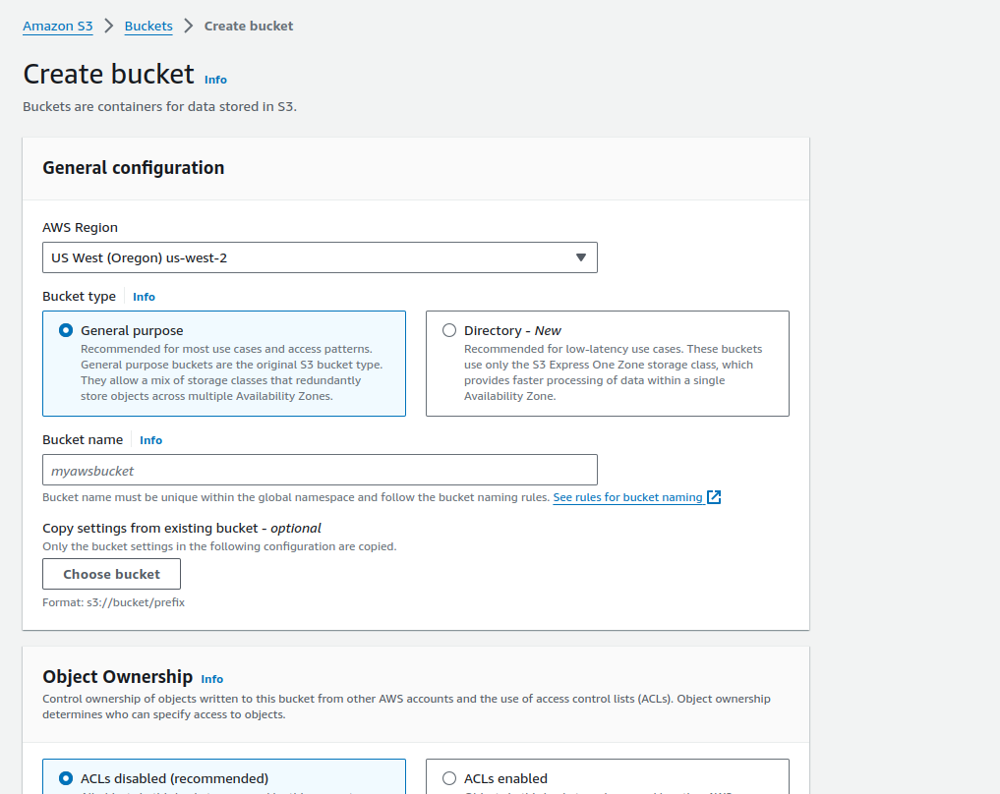

# Comprehensive Guide: Hosting a Static Site in AWS using CloudFront

This guide provides step-by-step instructions for hosting a static website in AWS using CloudFront for content delivery. Hosting static sites on AWS offers advantages in terms of scalability, security, and performance.

## Prerequisites

- An AWS account with appropriate permissions to create and configure CloudFront distributions, Route 53 DNS records, and SSL certificates using ACM.
- A static website with HTML, CSS, JavaScript, and any other assets ready for deployment.

## Steps

### Step 1: Configure S3 Bucket for Static Website Hosting

1. Create an S3 bucket in the desired AWS region.
    
2. Upload your static website files to the S3 bucket.
    
3. Enable static website hosting for the bucket and specify the index document and error document.
    

### Step 2: Obtain SSL Certificate using AWS Certificate Manager (ACM)

1. Navigate to the ACM console in the AWS Management Console.
2. Request a new SSL/TLS certificate for your domain (e.g., example.com).
3. Follow the instructions to validate domain ownership (DNS validation is recommended).

    

### Step 3: Create CloudFront Distribution

1. Go to the CloudFront console.
    
2. Click on "Create Distribution".
    
3. Configure the distribution settings:
   - Origin Domain Name: Select the S3 bucket endpoint.
   - Viewer Protocol Policy: Redirect HTTP to HTTPS.
   - SSL Certificate: Choose the SSL certificate obtained from ACM.
   - Default Root Object: Specify the index document (e.g., index.html).
4. Configure additional settings as needed (cache behavior, distribution settings, etc.).
5. Review and confirm the distribution creation.

### Step 4: Configure Route 53 DNS

1. Go to the Route 53 console.
    
2. Create a new hosted zone for your domain (if not already created).
3. Add a new record set of type A (Alias) and alias to the CloudFront distribution domain name.
4. Optionally, configure additional DNS records for subdomains or other purposes.

### Step 5: Testing and Validation

1. Wait for the CloudFront distribution status to change to "Deployed".
2. Access your static website using the CloudFront domain name or custom domain (after DNS propagation).
3. Test the website functionality, including navigation, asset loading, and HTTPS security.

## Conclusion

By following these steps, you can successfully host a static website in AWS using CloudFront for content delivery. This setup offers improved performance, scalability, and security for your website, enhancing the overall user experience.
