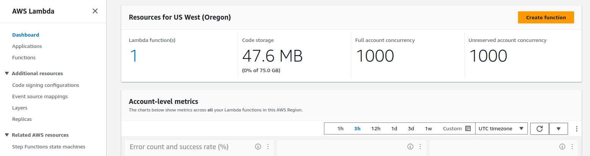

# Creating a Python Function in AWS Lambda

This document provides a detailed guide on how to create a Python function in AWS Lambda using the Lambda console.

## Step 1: Accessing the Lambda Console

1. [Navigate to the AWS Management Console.](https://console.aws.amazon.com)
    

2. [Select "Lambda" under the "Compute" section.](https://console.aws.amazon.com/lambda#)
    

## Step 2: Creating the Lambda Function

1. Click on the "Create function" button.
2. Choose "Author from scratch" option.
3. Configure the following settings:
   - **Function name:** Enter a name for the function.
   - **Runtime:** Choose "Python 3.12".
4. Click on the "Create function" button.

## Step 3: Configuring Test Event

1. After creating the function, scroll down to the "Function code" section.
2. Click on the "Test" button.
3. For Event name, enter "test".
4. Click on "Save changes" to save the test event.

## Step 4: Invoking the Function

1. To invoke the function, click on the "Test" button again.
2. Monitor the execution results in the "Execution result" section.

## Conclusion

By following these steps, you can easily create a Python function in AWS Lambda using the Lambda console. This enables you to execute Python code in a serverless environment, allowing for scalable and cost-effective solutions.
