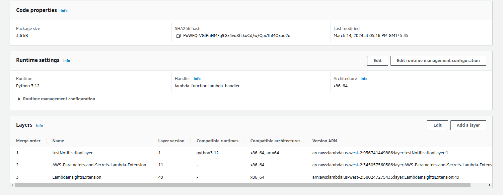

# Incorporating Layers in AWS Lambda

This section provides instructions on how to incorporate layers into an AWS Lambda function to manage dependencies effectively.

## Step 1: Creating a Layer

1. Navigate to the Lambda console.
2. Select "Layers" from the left-hand menu.

    

3. Click on the "Create layer" button.

    

4. Provide a name, description, and select the compatible runtime (Python 3.12).
5. Upload a .zip file containing the dependencies or code you want to include in the layer.
6. Click on the "Create" button to create the layer.

    

## Step 2: Adding Layer to Function

1. Go back to the Lambda function you created.
2. Scroll down to the "Function code" section.
3. In the "Layers" tab, click on "Add a layer".
4. Select the layer you created from the list of available layers.
5. Choose the appropriate version of the layer if multiple versions exist.
6. Click on the "Add" button to add the layer to your function.

    

## Step 3: Testing

1. Test the Lambda function to ensure that it can access the dependencies from the layer.
2. Monitor the CloudWatch logs for any errors or issues during function execution.

## Conclusion

Incorporating layers into an AWS Lambda function allows you to manage dependencies separately from the function code, making it easier to maintain and update your serverless applications. By following these steps, you can effectively include dependencies in your Lambda functions using layers.
