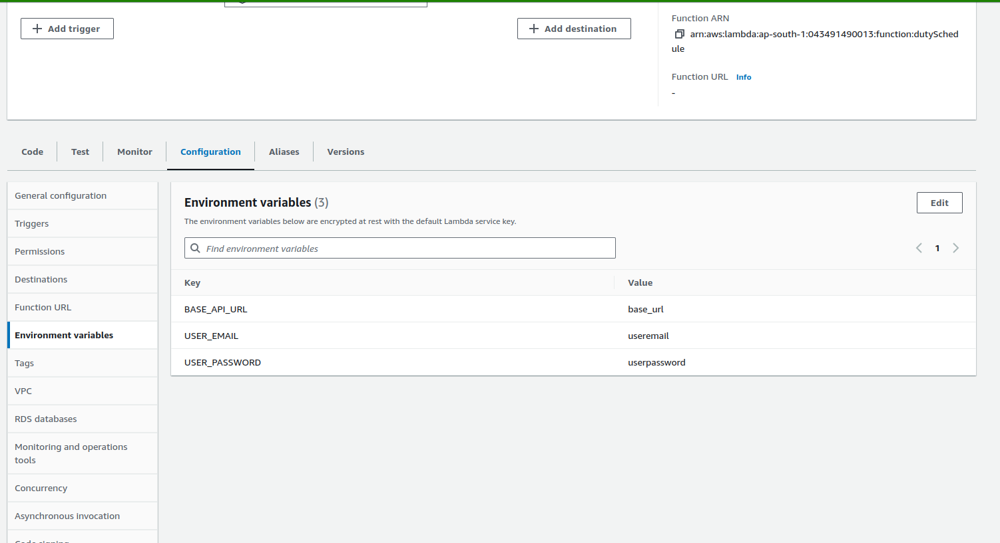

# Setting Up Environment Variables in AWS Lambda

This section outlines the process of setting up environment variables for AWS Lambda functions to enhance configurability.

## Step 1: Accessing Lambda Function Configuration

1. Navigate to the Lambda console.
2. Select the Lambda function for which you want to set up environment variables.

## Step 2: Configuring Environment Variables

1. Scroll down to the "Configuration" tab.
2. Under the "General configuration" section, locate the "Environment variables" subsection.
3. Click on the "Edit" button to modify environment variables.

## Step 3: Adding Environment Variables

1. Click on "Edit".
2. Add environment variables as key-value pairs.
3. Click on "Save" to apply the changes.

    

## Step 4: Accessing Environment Variables in Lambda Function

1. Within your Lambda function code, import the `os` module.
2. Access environment variables using `os.environ`.

    ```python
    import os

    my_var = os.environ['MY_VARIABLE']
    ```
