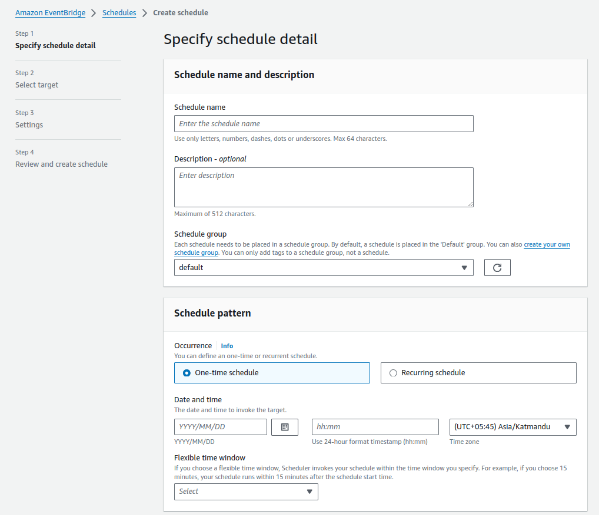

# Integrating AWS Lambda Function with EventBridge

This section explains how to integrate an AWS Lambda function with Amazon EventBridge for event-driven architecture. Additionally, it includes steps to create an EventBridge rule to trigger the Lambda function on a schedule.

## Step 1: Creating EventBridge Rule

1. Navigate to the EventBridge console.

    

2. Select "Rules" from the left-hand menu.
3. Click on the "Create rule" button.

    

## Step 2: Defining Rule Settings

1. Enter a name and description for the rule.
2. Under "Define pattern," choose "Event pattern."

    

3. Configure the event pattern to match the desired events or sources.
4. Click on "Add target" and select "Lambda function" as the target.

## Step 3: Selecting Lambda Function

1. Choose the Lambda function you want to trigger from the dropdown list.
2. Optionally, customize input transformations or error handling settings.
3. Click on the "Create" button to create the rule.

## Step 4: Testing the Integration

1. Test the integration by generating an event that matches the defined pattern.
2. Monitor the CloudWatch logs for the Lambda function to verify that it's triggered by EventBridge events.

## Creating EventBridge Schedule Every 1 Minute

To create an EventBridge schedule to trigger events every 1 minute, follow these steps:

1. Navigate to the EventBridge console.
2. Select "Rules" from the left-hand menu.
3. Click on the "Create rule" button.
4. Enter a name and description for the rule.
5. Under "Define pattern," choose "Schedule."
6. Enter a cron expression for the schedule. For every 1 minute, use: `cron(0/1 * * * ? *)`.
7. Click on "Add target" and select "Lambda function" as the target.
8. Choose the Lambda function you want to trigger.
9. Click on the "Create" button to create the rule.

    

## Conclusion

Integrating AWS Lambda functions with Amazon EventBridge enables event-driven architecture, allowing you to trigger functions based on specific events or schedules. By following these steps, you can easily configure EventBridge rules to trigger Lambda functions and create schedules for periodic invocations.
